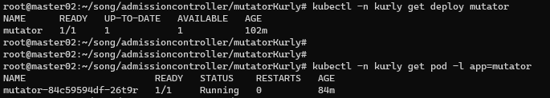
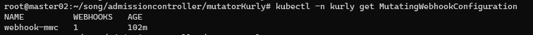
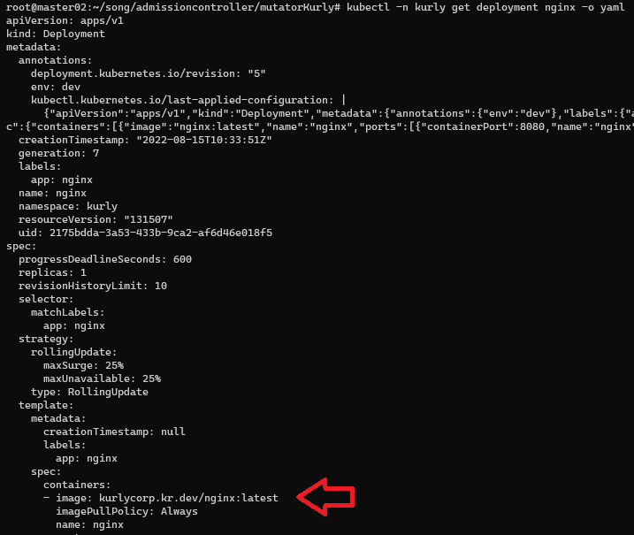

# AdmissionController-Mutatorkurly
>  k8s admission controller mutatorkurly deploy 검증


# 1. 시나리오

Kubernetes 관리자가 클러스터에 배포되는 리소스가 허용된 형상인지 여부를 컨트롤 할 수 있어야 한다.
어플리케이션은 Deployment 를 통해 배포되며 아래 조건을 만족하며 배포되어야 한다.

1) Deployment 로 배포되는 어플리케이션 이미지는 kurlycorp.kr.{ENV}만 허용

```
if ENV is dev:
   kurlycorp.kr.dev/*   이미지만 허용
   e.g. kurlycorp.kr.dev/nginx:latest
     
if ENV is prod:
   kurlycorp.kr.prod/* 이미지만 허용
   e.g. kurlycorp.kr.prod/nginx:latest
```

2. ENV 정보는 Deployment Annotation을 통해 제공

```yaml
apiVersion: apps/v1
kind: Deployment
metadata:
  name: {app_name}
  annotations:
    env: dev # here
    ...
```

3) 배포되는 어플리케이션 이미지가 허용되는 이미지와 다를 시 다음과 같이 동작함

```
if ENV is dev:
    잘못된 이미지 url을 수정한다.
     ex1)  quay.io/google-containers/cadvisor -> kurlycorp.kr.dev/google-containers/cadvisor
     ex2)  gcr.io/cadvisor/cadvisor -> kurlycorp.kr.dev/cadvisor/cadvisor
     
if ENV is prod:
    배포를 허용하지 않는다.
```


# 2. 인증서생성
> Mutator 서버가 https 통신만 가능하므로 인증서 필요


## 1) 인증서 생성

```bash
$ mkdir kurlyMutator
$ cd kurlyMutator

$ openssl genrsa -out ca.key 2048
$ openssl req -x509 -new -nodes -key ca.key -days 100000 -out ca.crt -subj "/CN=admission_ca"  

# Server Certificate을 만들기 위한 설정 파일을 생성
$ cat > server.conf <<EOF
[req]
req_extensions = v3_req
distinguished_name = req_distinguished_name
prompt = no
[req_distinguished_name]
CN = mutator.kurly.svc
[ v3_req ]
basicConstraints = CA:FALSE
keyUsage = nonRepudiation, digitalSignature, keyEncipherment
extendedKeyUsage = clientAuth, serverAuth
subjectAltName = @alt_names
[alt_names]
DNS.1 = mutator.kurly.svc
EOF

$ openssl genrsa -out server.key 2048
$ openssl req -new -key server.key -out server.csr -config server.conf
$ openssl x509 -req -in server.csr -CA ca.crt -CAkey ca.key -CAcreateserial -out server.crt -days 100000 -extensions v3_req -extfile server.conf

```


# 3. Mutator SRC

## 1) python flask
- cat > mutatorkurly.py
```python
from flask import Flask, request, jsonify
from pprint import pprint
import jsonpatch
import copy
import base64

app = Flask(__name__)


@app.route('/health')  
def health():  
    return "OK"


@app.route('/mutate', methods=['POST'])
def webhook():
    request_info = request.json
    request_info_object = request_info["request"]["object"]
    env = request_info_object["metadata"]["annotations"]["env"]
    print("env", env)
    # print(request_info_object)

    modified_info = copy.deepcopy(request_info)
    pprint(modified_info)
    modified_info_object = modified_info["request"]["object"]

    imageValidating = True
    for container_spec in modified_info_object["spec"]["template"]["spec"]["containers"]:
        print(
            "Let's check port of {}/{}... \n".format(modified_info_object["metadata"]["name"], container_spec['name']))
        if not check_image_name(env, container_spec):
            imageValidating = False
            imageValidatingReason = "deployment is not allowed"
            break
        # end if
    # end for

    if not imageValidating:
        admissionReview = {
            "apiVersion": "admission.k8s.io/v1",
            "kind": "AdmissionReview",
            "response": {
                "uid": request_info["request"]["uid"],
                "allowed": False,
                "status": {
                    "reason": imageValidatingReason
                }
            }
        }

        return jsonify(admissionReview)
    # end if

    patch = jsonpatch.JsonPatch.from_diff(request_info_object, modified_info_object)
    print("############## JSON Patch ############## ")
    pprint(str(patch))
    print('\n')

    if len(patch.patch) > 0:
        admissionReview = {
            "apiVersion": "admission.k8s.io/v1",
            "kind": "AdmissionReview",
            "response": {
                "uid": request_info["request"]["uid"],
                "allowed": True,
                "patchType": "JSONPatch",
                "patch": base64.b64encode(str(patch).encode()).decode()
            }
        }
    else:
        admissionReview = {
            "apiVersion": "admission.k8s.io/v1",
            "kind": "AdmissionReview",
            "response": {
                "uid": request_info["request"]["uid"],
                "allowed": True,
                "status": {
                    "reason": "Deployment is allowed"
                }
            }
        }
    # end if

    print("############## This data will be sent to k8s (admissionReview) ##############")
    pprint(admissionReview)
    print('\n')

    return jsonify(admissionReview)


def check_image_name(as_env, ad_container_spec):
    rtn = True
    image = ad_container_spec["image"]
    # image = 'kurlycorp.kr.dev/nginx:latest'
    image_seperate_index = image.find('/')
    if image_seperate_index < 0:
        if as_env == 'dev':
            imageNew = 'kurlycorp.kr.dev/' + image
            ad_container_spec['image'] = imageNew
            print('Image name is changed!\n\n')
            return True
        elif as_env == 'prod':
            return False
    image_prefix = image[:image_seperate_index]
    image_postfix = image[image_seperate_index + 1:]

    if as_env == 'dev':
        if not 'kurlycorp.kr.dev' == image_prefix:
            imageNew = 'kurlycorp.kr.dev/' + image_postfix
            ad_container_spec['image'] = imageNew
            print('Image name is changed!\n\n')
    if as_env == 'prod':
        if not 'kurlycorp.kr.prod' == image_prefix:
            rtn = False
            print('[Warning] deployment is not allowed!\n\n')

    return rtn


app.run(host='0.0.0.0', debug=True, ssl_context=('/run/secrets/tls/tls.crt', '/run/secrets/tls/tls.key'))

```


## 2) dockerize

- Dockerfile

```dockerfile
FROM python:3.7
RUN pip install flask
RUN pip install jsonpatch
WORKDIR /app
ADD mutatorkurly.py .
CMD ["python", "-u", "mutatorkurly.py"]
```


- build

```bash
$ docker build . -t ssongman/k8s-admission-controller-mutatorkurly:v0.52

$ docker login docker.io -ussongman -p
# Login Succeeded!

$ docker push ssongman/k8s-admission-controller-mutatorkurly:v0.52
```


# 4. Mutator 서버 생성


## 1) Namespace 생성

```bash
$ kubectl create ns kurly

```


## 2) secret 생성

기 생성한 인증서를 이용하여 tls secret 생성

```bash
$ kubectl -n kurly create secret tls mutator-certs \
   --cert "server.crt" \
   --key "server.key"
   
```


## 3) deployment-svc yaml

```yaml
$ cat > deploy/11.mutator-deployment-svc.yaml
---
apiVersion: apps/v1
kind: Deployment
metadata:
  name: mutator
  labels:
    app: mutator
spec:
  replicas: 1
  selector:
    matchLabels:
      app: mutator
  template:
    metadata:
      labels:
        app: mutator
    spec:
      containers:
      - name: mutator
        image: ssongman/k8s-admission-controller-mutatorkurly:v0.52
        imagePullPolicy: Always
        ports:
        - containerPort: 5000
          name: flask
        volumeMounts:
        - name: mutator-tls
          mountPath: /run/secrets/tls
          readOnly: true
      volumes:
      - name: mutator-tls
        secret:
          secretName: mutator-certs
---
apiVersion: v1
kind: Service
metadata:
  name: mutator
spec:
  selector:
    app: mutator
  ports:
    - port: 443
      targetPort: flask 
```


## 4) Mutator 서버 생성

```bash

$ kubectl -n kurly apply -f deploy/11.mutator-deployment-svc.yaml

```





# 5. MutatingWebhook 등록

>  MutatingWebhookConfiguration 등록


## 1) MutatingWebhook yaml

- mutate-webhook-configuration yaml
```yaml
$ cat > deploy/12.mutate-webhook-configuration.yaml
---
apiVersion: admissionregistration.k8s.io/v1
kind: MutatingWebhookConfiguration
metadata:
  name: webhook-mwc
webhooks:
  - name: mutator.kurly.svc
    clientConfig:
      service:
        name: mutator
        namespace: kurly
        path: "/mutate"
      caBundle: {{CA_PEM_BASE64}}
    rules:
      - operations: [ "CREATE", "UPDATE"]
        apiGroups: ["apps"]
        apiVersions: ["v1"]
        resources: ["deployments", "replicasets"]
    admissionReviewVersions: ["v1", "v1beta1"]
    sideEffects: None
    timeoutSeconds: 5
```

※ apiVersion이 맞아야 하므로  kubectl api-resources 명령으로 버젼 확인을 하면서 등록하자.


## 2) MutatingWebhook 생성


```bash
$ export CA_PEM_BASE64="$(openssl base64 -A <"ca.crt")"

$ cat deploy/12.mutate-webhook-configuration.yaml | sed "s/{{CA_PEM_BASE64}}/$CA_PEM_BASE64/g" | kubectl apply -n mutator -f -

# mutatingwebhookconfiguration.admissionregistration.k8s.io/webhook-mwc created

```




# 6. test deployment
> 시나리오에 적합한 deployment 로 테스트 수행


## 1) deployment yaml

```yaml
$ cat > deploy/13.nginx-deployment.yaml

apiVersion: apps/v1
kind: Deployment
metadata:
  annotations:
    env: "dev"    # dev, prod
  labels:
    app: nginx
  name: nginx
spec:
  replicas: 1
  selector:
    matchLabels:
      app: nginx
  template:
    metadata:
      labels:
        app: nginx
    spec:
      containers:
      - image: abcd/nginx:latest    # kurlycorp.kr.dev/nginx
        name: nginx
        ports:
        - containerPort: 8080
          name: nginx
          protocol: TCP
  
```


## 2) 생성 테스트

```bash
$ kubectl -n kurly apply -f deploy/13.nginx-deployment.yaml

```




## 3) 테스트 이력


### TC1)

- 입력조건

```yaml
annotations.env: "prod"
spec.containers.image: "kurlycorp.kr.prod/nginx"
```

- 수행결과: 성공

```bash
$ kubectl -n kurly apply -f deploy/13.nginx-deployment.yaml
deployment.apps/nginx configured
```


### TC2)

- 입력조건

```yaml
annotations.env: "prod"
spec.containers.image: "kurlycorp.kr.prod/nginx:latest"
```

- 수행결과: 성공

```bash
$ kubectl -n kurly apply -f deploy/13.nginx-deployment.yaml
deployment.apps/nginx configured
```


### TC3)

- 입력조건

```yaml
annotations.env: "prod"
spec.containers.image: "kurlycorp.kr.dev/nginx:latest"
```

- 수행결과: 실패,  Matator server(python Flask) 로부터 실패 메세지를 전달 받아 출력됨

```bash
$ kubectl -n kurly apply -f deploy/13.nginx-deployment.yaml
Error from server (deployment is not allowed): error when applying patch:
```


### TC4)

- 입력조건

```yaml
annotations.env: "dev"
spec.containers.image: "kurlycorp.kr.dev/nginx"
```

- 수행결과: 성공

```bash
$ kubectl -n kurly apply -f deploy/13.nginx-deployment.yaml
deployment.apps/nginx configured
```


### TC5)

- 입력조건

```yaml
annotations.env: "dev"
spec.containers.image: "quay.io/google-containers/cadvisor"
```

- 수행결과: 자동변경

```bash
$ kubectl -n kurly apply -f deploy/13.nginx-deployment.yaml
deployment.apps/nginx configured

$ kubectl -n kurly get deployment nginx --output=jsonpath={.spec.template.spec.containers[0].image}
kurlycorp.kr.dev/google-containers/cadvisor
```


### TC6)

- 입력조건

```yaml
annotations.env: "dev"
spec.containers.image: "gcr.io/cadvisor/cadvisor"
```

- 수행결과: 자동변경

```bash
$ kubectl -n kurly apply -f deploy/13.nginx-deployment.yaml
deployment.apps/nginx configured

$ kubectl -n kurly get deployment nginx --output=jsonpath={.spec.template.spec.containers[0].image}
kurlycorp.kr.dev/cadvisor/cadvisor
```


### TC7)

- 입력조건

```yaml
annotations.env: "dev"
spec.containers.image: "kurlycorp.kr.prod/nginx"
```

- 수행결과: 자동변경

```bash
$ kubectl -n kurly apply -f deploy/13.nginx-deployment.yaml
deployment.apps/nginx configured

$ kubectl -n kurly get deployment nginx --output=jsonpath={.spec.template.spec.containers[0].image}
kurlycorp.kr.dev/nginx
```


### TC8)

- 입력조건

```yaml
annotations.env: "dev"
spec.containers.image: "abcd/nginx"
```

- 수행결과: 자동변경

```bash
$ kubectl -n kurly apply -f deploy/13.nginx-deployment.yaml
deployment.apps/nginx configured

$ kubectl -n kurly get deployment nginx --output=jsonpath={.spec.template.spec.containers[0].image}
kurlycorp.kr.dev/nginx
```


### TC9)

- 입력조건

```yaml
annotations.env: "dev"
spec.containers.image: "nginx:latest"
```

- 수행결과: 자동변경

```bash
$ kubectl -n kurly apply -f deploy/13.nginx-deployment.yaml
deployment.apps/nginx configured

$ kubectl -n kurly get deployment nginx --output=jsonpath={.spec.template.spec.containers[0].image}
kurlycorp.kr.dev/nginx:latest
```


# 7. Clean Up

```bash

$ kubectl -n kurly delete pod alice-nginx
$ kubectl -n kurly delete deployment mutator
$ kubectl -n kurly delete svc mutator
$ kubectl delete MutatingWebhookConfiguration webhook-mwc
$ kubectl -n kurly delete secret mutator-certs

```


# 별첨. K8s Cluster Setup ( [가이드 문서 보기](./ktcloud-setup/ktcloud-setup.md) )  

## KTCloud에 k3s 용도 VM 생성

## k3s Cluster 설치
